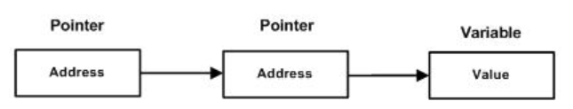

(&) operator, which denotes an address in memory.
pointer is a variable whose value is the address of another variable, i.e., direct address of the memory location.
you must declare a pointer before using it to store any variable address.
type *var-name;

A pointer that is assigned NULL is called a null pointer.

Pointer arithmetic:
There are four arithmetic operators that can be used on pointers: ++, --, +, and -
Pointers may be compared by using relational operators, such as ==, <, and >.

Array of pointers:
int *ptr[MAX];
declares ptr as an array of MAX integer pointers. Thus, each element in ptr, holds a pointer to an int value.

Pointer to Pointer:
main.c.5

A pointer to a pointer is a form of multiple indirection, or a chain of pointers.
Normally, a pointer contains the address of a variable. When we define a pointer to a pointer, the first pointer contains the address of the second pointer, which points to the location that contains the actual value
int **var;

Passing pointers to functions:
main.c.6
main.c.7

Return pointer from functions:
main.c
int * myFunction() {
   .
   .
   .
}
